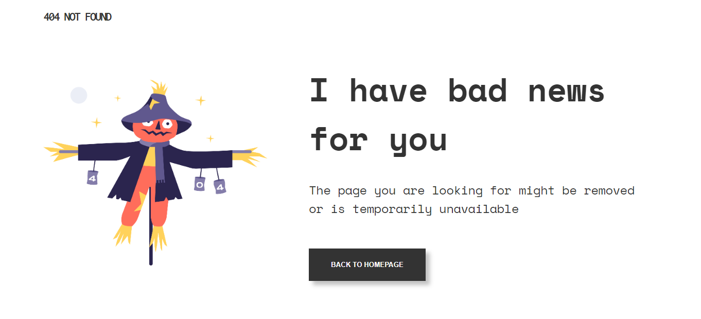
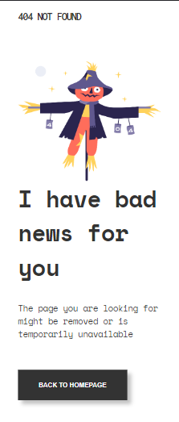

<!-- Please update value in the {}  -->

<h1 align="center">{404 Page Not Found}</h1>

   Solution for a challenge from  <a href="http://devchallenges.io" target="_blank">Devchallenges.io</a>.

  <h3>
    <a href="https://kamba56.github.io/404NotFoundPage/">
      Demo
    </a>
     | 
    <a href="https://github.com/Kamba56/404NotFoundPage.git">
      Solution
    </a>
     | 
    <a href="https://devchallenges.io/challenges/wBunSb7FPrIepJZAg0sY">
      Challenge
    </a>
  </h3>

<!-- TABLE OF CONTENTS -->

## Table of Contents

- [Overview](#overview)
  - [Built With](#built-with)
- [Features](#features)
- [Contact](#contact)
- [Acknowledgements](#acknowledgements)

<!-- OVERVIEW -->

## Overview

I really enjoyed the short time working on this project. I improved on the use of the `flex` property in CSS3.
You can find the demo of the webpage [here](https://kamba56.github.io/404NotFoundPage/) 

### Built With

<!-- This section should list any major frameworks that you built your project using. Here are a few examples.-->

- [HTML](https://html.com/)
- [CSS](https://css.com/)

## Features

<!-- List the features of your application or follow the template. Don't share the figma file here :) -->

This application/site was created as a submission to a [DevChallenges](https://devchallenges.io/challenges) challenge. The [challenge](https://devchallenges.io/challenges/wBunSb7FPrIepJZAg0sY) was to build a 404 Page Not Found error page that links user to the homepage.

## Acknowledgements

<!-- This section should list any articles or add-ons/plugins that helps you to complete the project. This is optional but it will help you in the future. For exmpale -->

- [Steps to replicate a design with only HTML and CSS](https://devchallenges-blogs.web.app/how-to-replicate-design/)
- [Node.js](https://nodejs.org/)
- [Marked - a markdown parser](https://github.com/chjj/marked)

## Contact

👤 **Toma John Musa**
- GitHub: [@Kamba56](https://github.com/Kamba56)
- Twitter: [@Kamba_TJ](https://twitter.com/Kamba_TJ)
- LinkedIn: [Toma](https://linkedin.com/in/toma-john-47092622b)
